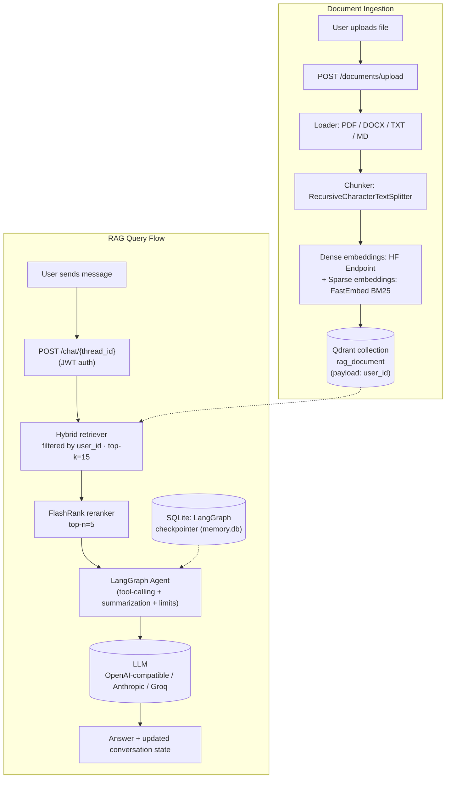

# PaperWhisper

A multi-user, production-shaped **Retrieval-Augmented Generation backend** that lets authenticated users upload documents and ask questions answered strictly from their own content — with hybrid retrieval, reranking, persistent conversation memory, and automated RAG evaluation.

Built to solve a real problem: generic LLM answers are unreliable for private/domain documents. This system grounds every answer in retrieved, user-scoped document chunks, with an agent that refuses to guess when it can't find the answer.

## Key Features

- **Multi-user document Q&A** — upload PDFs/DOCX/TXT/MD, ask questions, get answers grounded only in *your* documents
- **Hybrid retrieval** — dense (semantic) + sparse (BM25) vector search fused in Qdrant, not just cosine similarity
- **Cross-encoder reranking** — FlashRank reranks the hybrid candidates before they reach the LLM
- **Agentic RAG** — a LangGraph agent (not a static chain) decides when to call the retriever tool, with tool-call limits and automatic conversation summarization
- **Persistent, resumable conversations** — LangGraph SQLite checkpointing gives each chat thread durable memory across requests
- **Strict per-user data isolation** — every retrieval is filtered by a Qdrant payload filter derived from the authenticated JWT identity, never from client input
- **JWT authentication** — registration/login via `fastapi-users`, immutable usernames by design
- **Automated RAG evaluation** — RAGAS metrics (faithfulness, context precision/recall) run against a curated test set
- **Observability** — Logfire instrumentation across ingestion and retrieval
- **Dockerized & CI-tested** — GitHub Actions runs the live agent/retriever test suite on every push

## Architecture



## RAG Pipeline

| Stage | Implementation |
|---|---|
| **Loading** | `PyPDFLoader`, `Docx2txtLoader`, `TextLoader` (LangChain) parse PDF/DOCX/TXT/MD and tag every document with `user_id` metadata |
| **Chunking** | `RecursiveCharacterTextSplitter`, chunk size 1000 / overlap 100, configurable via `config.yaml` |
| **Embeddings** | Dense: `sentence-transformers/all-MiniLM-L6-v2` via HuggingFace Inference Endpoint. Sparse: `Qdrant/bm25` via FastEmbed |
| **Indexing** | `QdrantVectorStore` in `RetrievalMode.HYBRID`, upserted per user with a keyword payload index on `metadata.user_id` for isolation |
| **Retrieval** | Hybrid dense+sparse search (top-k = 15) scoped to the requesting user via a Qdrant `Filter` |
| **Reranking** | `FlashrankRerank` (`ms-marco-MiniLM-L-12-v2`) via `ContextualCompressionRetriever`, cut down to top 5 |
| **Generation** | A LangGraph agent exposes retrieval as a tool, is instructed to answer *only* from retrieved content, and is bounded by `SummarizationMiddleware` (token-triggered history compression) and `ToolCallLimitMiddleware` |
| **Memory** | Conversation state persisted per `thread_id` via `AsyncSqliteSaver` (LangGraph checkpointer), separate from the app's relational data |
| **Evaluation** | RAGAS `Faithfulness`, `LLMContextRecall`, `LLMContextPrecisionWithReference` scored against a hand-built `ragas_test_dataset.json` |

## Tech Stack

- **Backend**: FastAPI, Uvicorn, Pydantic, SQLAlchemy (async) + aiosqlite
- **Auth**: fastapi-users, JWT bearer tokens
- **Orchestration**: LangChain, LangGraph (`create_agent`, middleware, SQLite checkpointing)
- **Vector DB**: Qdrant (hybrid dense + sparse search, per-user payload filtering)
- **Embeddings**: HuggingFace Inference Endpoints (dense) + FastEmbed BM25 (sparse)
- **Reranker**: FlashRank
- **LLM**: Configurable provider — OpenAI-compatible endpoint / Anthropic / Groq (env-driven)
- **Document parsing**: PyPDF, docx2txt
- **Evaluation**: RAGAS
- **Observability**: Logfire
- **Dependency management**: uv
- **Containerization**: Docker
- **CI**: GitHub Actions (pytest against the live agent + retriever)

## Backend Architecture

- **Layered structure**: `api/routes` (HTTP layer) → `api/` (models, schemas, DB session, auth) → `agent/` (LangGraph agent + retriever tool) → `vector_store/` (ingestion, chunking, Qdrant access)
- **Two independent SQLite stores**: `app.db` (users, conversations) and `memory.db` (LangGraph checkpoints). Deleting a conversation explicitly cleans both — deleting the row alone would silently leave orphaned agent state
- **Identity-driven isolation**: the RAG `user_id` is always taken from the authenticated JWT (`current_user.username`), never from the request body, so one user can never query another user's documents
- **Lazy, cached Qdrant client**: a module-level singleton (`get_client`) avoids reconnecting on every request
- **FastAPI lifespan hook**: initializes the database schema and opens the LangGraph checkpointer once at startup, shared across requests via `app.state`
- **Centralized config**: chunking, embedding model, LLM provider, and DB paths live in `config.yaml`, loaded through a single `load_config()`
- **Deliberate API surface control**: the default `fastapi-users` "update me" route is intentionally *not* mounted, since it would allow username mutation — usernames are the RAG identity key and must stay immutable

## API Endpoints

| Method | Endpoint | Purpose |
|---|---|---|
| POST | `/auth/register` | Register a new user |
| POST | `/auth/jwt/login` | Log in, receive a JWT bearer token |
| GET | `/auth/me` | Get the current authenticated user |
| POST | `/documents/upload` | Upload a document, parse, chunk, and ingest into Qdrant for the current user |
| POST | `/chats` | Start a new conversation thread |
| GET | `/chats` | List the current user's conversations |
| GET | `/chats/{thread_id}` | Get a single conversation (ownership-checked) |
| DELETE | `/chats/{thread_id}` | Delete a conversation and its LangGraph checkpoint state |
| POST | `/chat/{thread_id}` | Send a message; runs the RAG agent and returns a grounded answer |

## Project Structure

```
document_rag/
├── agent/
│   ├── agent.py            # LangGraph agent: system prompt, middleware, checkpointer
│   └── retriever_tool.py   # Hybrid retriever + FlashRank reranking as a tool
├── api/
│   ├── routes/
│   │   ├── auth.py         # Registration / JWT login
│   │   ├── documents.py    # Upload → ingestion
│   │   └── chat.py         # Conversations + RAG chat
│   ├── database.py         # Async SQLAlchemy engine/session
│   ├── models.py           # User, Conversation ORM models
│   ├── schemas.py          # Pydantic request/response models
│   ├── users.py            # fastapi-users manager, JWT backend
│   ├── conversations.py    # Ownership checks, checkpoint cleanup
│   └── dependencies.py     # Shared FastAPI dependencies
├── vector_store/
│   ├── ingestion/
│   │   ├── loader.py       # PDF/DOCX/TXT/MD parsing
│   │   └── chunker.py      # Recursive text splitting
│   ├── qdant/qdant.py      # Hybrid Qdrant store, ingestion, user-scoped retriever
│   └── factor/factor.py    # Embedding model, pluggable LLM, checkpointer factory
├── config/
│   ├── config.py            # YAML config loader
│   └── config.yaml          # Chunking, model, DB path settings
├── evals/
│   ├── rag_eval.py                  # RAGAS evaluation run
│   └── ragas_test_dataset.json      # Evaluation dataset
└── test/test.py            # Live agent/retriever integration test (runs in CI)
main.py                     # FastAPI app, lifespan, router registration
Dockerfile
pyproject.toml / uv.lock
```
*(the `frontend/` folder is a separate, AI-generated UI and is out of scope for this README)*

## Setup & Running

### Prerequisites
- Python 3.12+ and [uv](https://docs.astral.sh/uv/)
- A Qdrant instance (cloud or self-hosted)
- A HuggingFace token (dense embeddings) and an LLM API key (OpenAI-compatible / Anthropic / Groq)

### Local
```bash
git clone https://github.com/yadavnitesh86/enhaced_rag_document.git
cd paperwhisper
uv sync

# create a .env with:
# LLM_PROVIDER=openai | anthropic | ChatGroq
# LLM_MODEL=...
# LLM_BASE_URL=...          # optional, for OpenAI-compatible endpoints
# LLM_API_KEY=...
# QDRANT_URL=...
# QDRANT_API_KEY=...
# HF_TOKEN=...
# JWT_SECRET=...
# JWT_EXPIRE_MINUTES=30
# LOGFIRE_TOKEN=...         # optional

uv run uvicorn main:app --reload
```
API docs available at `http://localhost:8000/docs`.

### Docker
```bash
docker build -t paperwhisper .
docker run -p 8000:8000 --env-file .env paperwhisper
```
The image pre-downloads the FlashRank reranker model at build time so there's no cold-start download in production.

### Running evaluation
```bash
uv run python document_rag/evals/rag_eval.py
```

## Engineering Highlights

- **Identity-scoped retrieval**: Qdrant payload filtering tied to the JWT-derived `user_id`, not request input — a real data-isolation guarantee, not just an application-level convention
- **Hybrid search + reranking pipeline**: dense + sparse retrieval fused in Qdrant, then cross-encoder reranked before hitting the LLM, instead of relying on raw vector similarity alone
- **Durable agent memory**: LangGraph SQLite checkpointing persists conversation state independently of the relational app DB, with explicit dual cleanup on conversation deletion
- **Bounded agent execution**: `SummarizationMiddleware` compresses long histories on a token trigger; `ToolCallLimitMiddleware` caps tool calls per run/thread to control cost and runaway loops
- **Provider-agnostic LLM layer**: swapping between OpenAI-compatible, Anthropic, and Groq backends is a config/env change, not a code change
- **Automated, metric-based evaluation**: RAGAS faithfulness/precision/recall scoring against a fixed dataset, rather than manual spot-checking
- **CI-verified retrieval + agent path**: GitHub Actions runs a live integration test against the actual agent and retriever on every push
- **Traceable pipeline**: Logfire spans instrument ingestion and retrieval for debugging and observability

## Future Improvements

- Streaming responses (SSE/WebSocket) for the chat endpoint
- Response/embedding caching for repeated queries
- Broader file support (images, tables, structured data)
- Per-user/API rate limiting
- Metrics dashboard on top of Logfire traces
- HTTP-level integration tests for the API routes (currently only the agent/retriever path is tested)

## Author

**Nitesh Yadav** — Aspiring Applied AI Engineer
